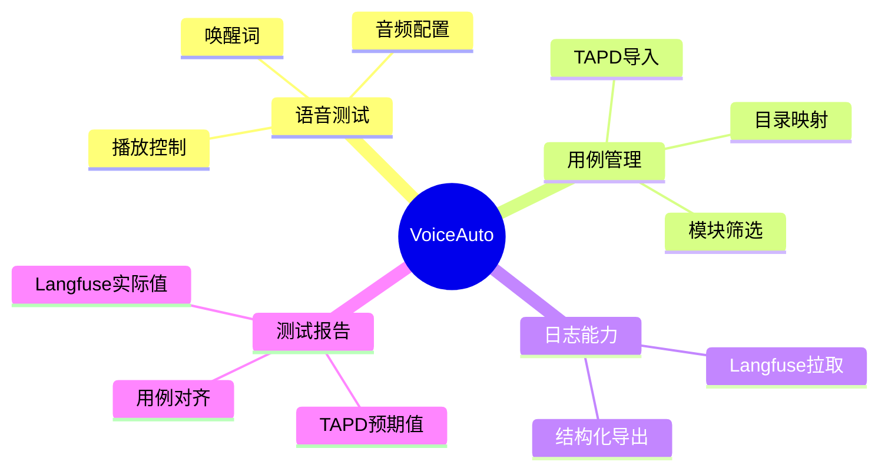

# VoiceAuto 项目记忆

## 文档定位

- 用途：沉淀项目长期稳定信息与协作约定，减少重复沟通成本。
- 读者：协作开发者与 AI 助手。
- 原则：记录稳定事实与约定，不记录短期临时事项。

## 1. 项目快照

- 项目名称：VoiceAuto
- 形态：纯前端应用（Browser-Based）
- 主目标：语音测试 + 测试过程记录 + Langfuse 日志拉取导出的闭环

## 2. 技术基线

- React 18
- Vite 5
- Tailwind CSS
- Web Speech API / 豆包 TTS（失败自动回退）
- 状态管理：React Context + useReducer
- 导出能力：xlsx / file-saver / jszip

## 3. 稳定协作约定

### 3.1 研发与验证

- 代码修改后至少完成一次可执行验证（构建或关键流程验证）。
- 默认验证顺序：`npm run build` 后 `npm run dev`。
- 出现连续异常时，最多重试 2 次后停止并说明原因。

### 3.2 文档归档

- 架构说明维护在 `docx/PRODUCT_ARCH.md`。
- 产品说明维护在 `docx/PRODUCT_INTRODUCE.md`。
- Bug 明细维护在 `docx/BUGFIX.md`。
- 功能优化明细维护在 `docx/FEATURE_OPTIMIZATION.md`。
- TAPD 导入方案维护在 `docx/TAPD_IMPORT_GUIDE.md`。
- `docx` 记录文件持续更新，不按日期拆分新文件。

### 3.3 AI 协作文件约定

- 全局规则：`.claude/CLAUDE.md`
- 目录级规则：`.claude/rules/`
- 流程化能力：`.claude/skills/`
- 个人偏好：`CLAUDE.local.md`（不入库）

## 4. 模块化迁移记忆

### 4.1 已完成迁移

- `src/services/langfuseService.js` -> `src/modules/langfuse/services/langfuseService.js`
- `src/utils/excelExport.js` -> `src/modules/langfuse/utils/sessionExtractor.js` + `src/modules/langfuse/utils/excelExporter.js`

### 4.2 待按需迁移

- 音频相关 -> `modules/audio/`
- 测试相关 -> `modules/test/`
- 日志相关 -> `modules/log/`
- 配置相关 -> `modules/config/`

### 4.3 导入规范

- 推荐通过模块 `index.js` 导出入口跨模块调用。
- 避免跨层级深路径引用造成耦合。

## 5. 测试报告与数据对齐记忆

- 报告预期值来源：目标文本、目标 Agent 优先从 TAPD 测试计划关联的测试用例中获取。
- TAPD 目标 Agent 推荐维护在测试用例自定义字段“目标Agent”中；导入时通过 `tcases/custom_fields_settings` 识别对应 `custom_field_xx`，再在 `/tcases` 查询详情时读取并转换枚举值。
- TAPD 目标文本可维护在测试用例自定义字段“目标文本”中；没有该字段时继续从步骤里的 Human/User/用户/人类语句提取。
- Langfuse 实际值来源：实际输入文本从 ASR final/input 类 observation 提取；命中 Agent 优先从 `[run_agent]` observation 的 `input.agent_code` 提取；输出文本优先从 `[full_answer]` observation 的 `output.content` 提取。
- 报告表格以测试计划目标文本为主，必须显示全部目标文本；Langfuse 日志只用于填充实际输入、命中 Agent、输出、耗时、错误信息等实际值。
- 用例对齐优先级：`run_id + case_id` -> `case_id` -> `audio_file` -> 播放时间窗口 -> 文本相似度 -> 顺序兜底。
- 是否通过的核心判定：目标 Agent 与命中 Agent 一致即意图识别通过；文本相似度仅用于辅助说明对齐质量，不作为主要通过条件。

## 6. 非架构信息归档说明

- 架构文档不再维护逐日变更清单。
- 日常变更以 `docx/BUGFIX.md` 和 `docx/FEATURE_OPTIMIZATION.md` 为准。
- 本文档仅保留项目长期稳定信息与协作记忆。
