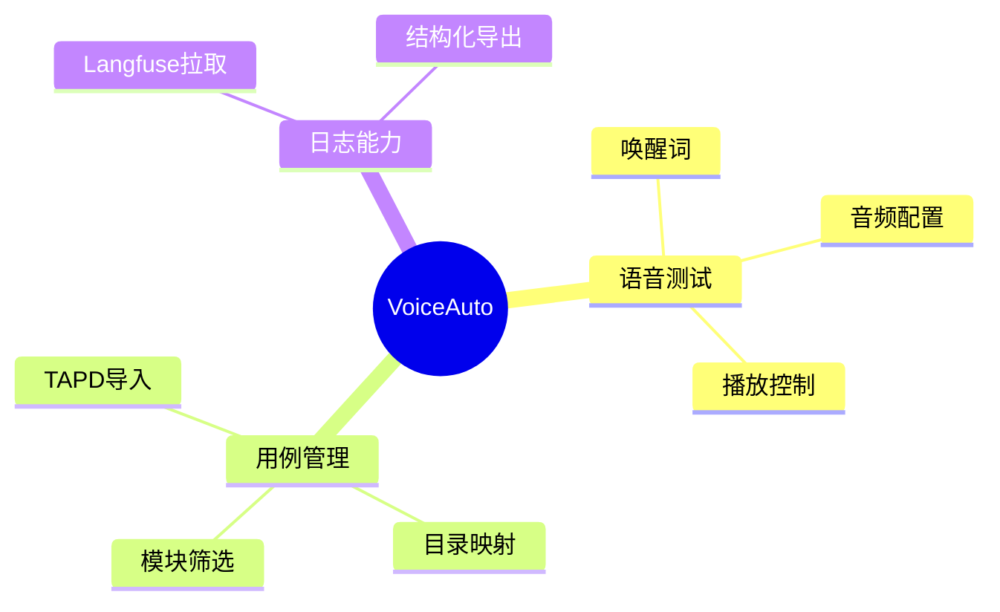

# VoiceAuto 项目记忆

## 文档定位

- 用途：沉淀项目长期稳定信息与协作约定，减少重复沟通成本。
- 读者：协作开发者与 AI 助手。
- 原则：记录稳定事实与约定，不记录短期临时事项。

## 1. 项目快照

- 项目名称：VoiceAuto
- 形态：纯前端应用（Browser-Based）
- 主目标：语音测试 + 测试过程记录 + Langfuse 日志拉取导出的闭环

## 2. 技术基线

- React 18
- Vite 5
- Tailwind CSS
- Web Speech API / 豆包 TTS（失败自动回退）
- 状态管理：React Context + useReducer
- 导出能力：xlsx / file-saver / jszip

## 3. 稳定协作约定

### 3.1 研发与验证

- 代码修改后至少完成一次可执行验证（构建或关键流程验证）。
- 默认验证顺序：`npm run build` 后 `npm run dev`。
- 出现连续异常时，最多重试 2 次后停止并说明原因。

### 3.2 文档归档

- 架构说明维护在 `docx/arch.md`。
- 产品说明维护在 `docx/PRODUCT.md`。
- Bug 明细维护在 `docx/BUGFIX-RECORD.md`。
- 功能优化明细维护在 `docx/FEATURE-OPTIMIZATION-RECORD.md`。
- `docx` 记录文件持续更新，不按日期拆分新文件。

### 3.3 AI 协作文件约定

- 全局规则：`.claude/CLAUDE.md`
- 目录级规则：`.claude/rules/`
- 流程化能力：`.claude/skills/`
- 个人偏好：`CLAUDE.local.md`（不入库）

## 4. 模块化迁移记忆

### 4.1 已完成迁移

- `src/services/langfuseService.js` -> `src/modules/langfuse/services/langfuseService.js`
- `src/utils/excelExport.js` -> `src/modules/langfuse/utils/sessionExtractor.js` + `src/modules/langfuse/utils/excelExporter.js`

### 4.2 待按需迁移

- 音频相关 -> `modules/audio/`
- 测试相关 -> `modules/test/`
- 日志相关 -> `modules/log/`
- 配置相关 -> `modules/config/`

### 4.3 导入规范

- 推荐通过模块 `index.js` 导出入口跨模块调用。
- 避免跨层级深路径引用造成耦合。

## 5. 非架构信息归档说明

- 架构文档不再维护逐日变更清单。
- 日常变更以 `docx/BUGFIX-RECORD.md` 和 `docx/FEATURE-OPTIMIZATION-RECORD.md` 为准。
- 本文档仅保留项目长期稳定信息与协作记忆。
