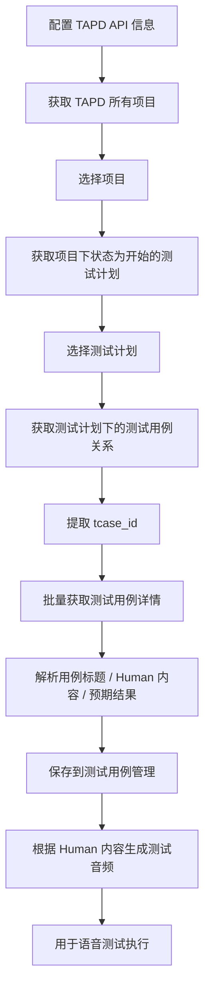

# TAPD 开放接口导入测试用例方案

## 1. 目标

通过 **TAPD 开放 API** 完成测试用例导入，导入后的用例展示在系统的 **「测试用例管理」** 菜单下，并用于后续生成测试音频、执行语音自动化测试。

本方案覆盖以下流程：



---

## 2. TAPD 开放接口说明

TAPD 提供开放 API，接口域名通常为：

```text
https://api.tapd.cn
```

常用接口均使用 **HTTP Basic Auth** 鉴权：

```bash
curl -u 'api_user:api_password' 'https://api.tapd.cn/接口路径'
```

### 2.1 需要准备的参数

| 参数 | 说明 |
|---|---|
| `api_user` | TAPD API 账号 |
| `api_password` | TAPD API 密码 |
| `company_id` | 公司 ID，用于获取公司下所有项目 |
| `workspace_id` | TAPD 项目 ID |
| `test_plan_id` | TAPD 测试计划 ID |

### 2.2 当前系统参数来源

TAPD 导入向导使用配置中心保存的数据库配置，不再在导入窗口中维护独立参数。

| 页面展示 | 配置字段 | 说明 |
|---|---|---|
| API User | `apiUser` | 应用 ID / API User |
| API Password | `apiPassword` | 应用密钥 |
| Company ID | `companyId` | 公司 ID |
| 项目ID | `workspaceId` | TAPD 项目 ID |

使用约定：

- 如需修改 TAPD 参数，进入“配置中心 -> TAPD 配置”保存。
- 保存后重新打开 TAPD 导入向导即可读取最新配置。
- 导入向导第一步只读展示参数，避免临时输入和配置中心不一致。
- 项目选择默认使用配置中的 `workspaceId`；项目列表仅用于核对项目名称。

---

## 3. 本功能使用的 TAPD API

### 3.1 获取所有项目

用于进入导入页面时，拉取 TAPD 公司下所有项目。

```http
GET https://api.tapd.cn/workspaces/projects
```

请求参数：

| 参数 | 是否必填 | 说明 |
|---|---:|---|
| `company_id` | 是 | 公司 ID |
| `category` | 否 | 项目类型，建议传 `project` |
| `with_extends` | 否 | 传 `1` 可返回自定义字段 |

curl 示例：

```bash
curl -u 'api_user:api_password' \
'https://api.tapd.cn/workspaces/projects?company_id=20003261&category=project'
```

返回字段重点关注：

| 字段 | 说明 |
|---|---|
| `Workspace.id` | 项目 ID，即 `workspace_id` |
| `Workspace.name` | 项目名称 |
| `Workspace.status` | 项目状态 |
| `Workspace.category` | 项目类型 |
| `Workspace.parent_id` | 父项目 ID |
| `Workspace.member_count` | 项目人数 |

---

### 3.2 获取项目下状态为开始的测试计划

用户选择项目后，系统根据项目 ID 拉取该项目下状态为开始的测试计划。

```http
GET https://api.tapd.cn/test_plans
```

请求参数：

| 参数 | 是否必填 | 说明 |
|---|---:|---|
| `workspace_id` | 是 | 项目 ID |
| `status` | 否 | 测试计划状态，开始状态传 `open` |
| `limit` | 否 | 每页数量，最大建议 200 |
| `page` | 否 | 页码 |
| `fields` | 否 | 指定返回字段 |

curl 示例：

```bash
curl -u 'api_user:api_password' \
'https://api.tapd.cn/test_plans?workspace_id=10158231&status=open&limit=200&page=1'
```

状态映射建议：

| TAPD 状态 | 页面显示 |
|---|---|
| `open` | 开始 |
| `close` | 关闭 |

返回字段重点关注：

| 字段 | 说明 |
|---|---|
| `TestPlan.id` | 测试计划 ID |
| `TestPlan.name` | 测试计划名称 |
| `TestPlan.workspace_id` | 项目 ID |
| `TestPlan.owner` | 测试计划负责人 |
| `TestPlan.status` | 测试计划状态 |
| `TestPlan.start_date` | 预计开始时间 |
| `TestPlan.end_date` | 预计结束时间 |

---

### 3.3 获取测试计划下的测试用例关系

用户选择测试计划并点击「开始导入」后，先通过测试计划获取关联的测试用例 ID。

```http
GET https://api.tapd.cn/test_plans/get_test_plan_tcase
```

请求参数：

| 参数 | 是否必填 | 说明 |
|---|---:|---|
| `workspace_id` | 是 | 项目 ID |
| `test_plan_id` | 是 | 测试计划 ID |
| `limit` | 否 | 每页数量，默认 30 |
| `page` | 否 | 页码，默认第 1 页 |
| `order` | 否 | 排序规则 |

curl 示例：

```bash
curl -u 'api_user:api_password' \
'https://api.tapd.cn/test_plans/get_test_plan_tcase?workspace_id=10158231&test_plan_id=1000000755077233617&limit=200&page=1'
```

返回示例：

```json
{
  "status": 1,
  "data": [
    {
      "TestPlanStoryTcaseRelation": {
        "id": "1000000755002248699",
        "workspace_id": "755",
        "test_plan_id": "1000000755077233617",
        "story_id": "0",
        "tcase_id": "1000000755000026804",
        "sort": "0",
        "creator": "tester",
        "created": "0000-00-00 00:00:00"
      }
    }
  ],
  "info": "success"
}
```

重点提取：

```text
TestPlanStoryTcaseRelation.tcase_id
```

---

### 3.4 根据 tcase_id 批量获取测试用例详情

获取到 `tcase_id` 后，再调用测试用例详情接口批量获取完整用例信息。

```http
GET https://api.tapd.cn/tcases
```

请求参数：

| 参数 | 是否必填 | 说明 |
|---|---:|---|
| `workspace_id` | 是 | 项目 ID |
| `id` | 否 | 测试用例 ID，支持多 ID 查询，多个 ID 用英文逗号分隔 |
| `fields` | 否 | 指定返回字段 |
| `limit` | 否 | 每页数量，最大建议 200 |
| `page` | 否 | 页码 |

本功能建议指定字段：

```text
id,name,steps,expectation,priority,status,category_id
```

curl 示例：

```bash
curl -u 'api_user:api_password' \
'https://api.tapd.cn/tcases?workspace_id=10158231&id=1000000755000026804,1000000755075912019&fields=id,name,steps,expectation,priority,status,category_id&limit=200'
```

返回字段重点关注：

| TAPD 字段 | 用途 |
|---|---|
| `id` | TAPD 用例 ID |
| `name` | 用例标题 |
| `steps` | 用例步骤，用于解析 Human 内容 |
| `expectation` | 预期结果 |
| `priority` | 优先级 |
| `status` | 用例状态 |
| `category_id` | 用例目录，可作为模块 |

---

### 3.5 获取测试用例自定义字段配置

用于识别 TAPD 测试用例中“目标Agent”“目标文本”对应的 `custom_field_xx`，避免依赖步骤描述解析。

```http
GET https://api.tapd.cn/tcases/custom_fields_settings
```

请求参数：

| 参数 | 是否必填 | 说明 |
|---|---:|---|
| `workspace_id` | 是 | 项目 ID |

curl 示例：

```bash
curl -u 'api_user:api_password' \
'https://api.tapd.cn/tcases/custom_fields_settings?workspace_id=10158231'
```

处理规则：

1. 遍历返回的自定义字段配置。
2. 查找字段名为“目标Agent”的配置，兼容别名：`预期Agent`、`期望Agent`、`目标智能体`、`Agent`、`target_agent`。
3. 读取该配置中的 `custom_field`，例如 `custom_field_30`。
4. 如果字段类型为下拉枚举，需要读取 `options`，用于将接口返回值转换为真实 Agent 名称。
5. 同理可查找“目标文本”字段，兼容 `目标语句`、`测试文本`、`输入文本`、`target_text` 等别名。

示例配置：

```json
{
  "name": "目标Agent",
  "custom_field": "custom_field_30",
  "type": "select",
  "options": {
    "1": "WeatherAgent",
    "2": "MusicAgent",
    "3": "DeviceControlAgent"
  }
}
```

最终查询 `/tcases` 时应动态追加字段：

```text
id,name,steps,expectation,priority,status,category_id,category_name,module_name,custom_field_30
```

若“目标文本”也有自定义字段，例如 `custom_field_31`，则同步追加：

```text
id,name,steps,expectation,priority,status,category_id,category_name,module_name,custom_field_30,custom_field_31
```

目标字段优先级：

| 数据 | 优先级 |
|---|---|
| 目标 Agent | TAPD 自定义字段 -> steps/expectation/name 文本解析兜底 |
| 目标文本 | TAPD 自定义字段 -> steps 中 Human/User/用户/人类语句 |

---

## 4. 页面功能设计

### 4.1 测试用例管理菜单

在系统左侧菜单中保留：

```text
测试用例管理
```

页面新增按钮：

```text
从 TAPD 导入
```

### 4.2 TAPD 导入弹窗 / 导入页面

建议设计为 4 步：

```text
步骤一：选择项目
步骤二：选择开始状态的测试计划
步骤三：确认导入
步骤四：查看导入结果
```

#### 步骤一：选择项目

页面调用：

```http
GET /api/tapd/projects
```

展示字段：

| 项目 ID | 项目名称 | 项目状态 | 操作 |
|---|---|---|---|
| 10158231 | Cedar 项目 | normal | 选择 |

#### 步骤二：选择测试计划

页面调用：

```http
GET /api/tapd/projects/{workspaceId}/test-plans?status=open
```

展示字段：

| 测试计划 ID | 测试计划名称 | 负责人 | 状态 | 操作 |
|---|---|---|---|---|
| 1000000755077233617 | Cedar 语音回归测试 | tester01 | 开始 | 选择 |

#### 步骤三：开始导入

页面调用：

```http
POST /api/voice-test-cases/import-from-tapd-plan
```

请求示例：

```json
{
  "workspaceId": "10158231",
  "testPlanId": "1000000755077233617",
  "overwrite": true
}
```

#### 步骤四：导入结果

展示：

| 指标 | 说明 |
|---|---|
| 总用例数 | 测试计划下全部用例数 |
| 成功导入数 | 成功解析并保存的用例数 |
| 跳过数 | 无 Human 内容等原因跳过 |
| 失败数 | API 异常、字段异常等失败 |
| 失败原因 | 展示具体用例和原因 |

---

## 5. 测试用例管理页面展示字段

导入成功后，用例展示在「测试用例管理」页面。

| 字段 | 说明 |
|---|---|
| 用例标题 | 来自 TAPD `name` |
| Human 内容 | 从 TAPD `steps` 中解析 |
| 预期结果 | 来自 TAPD `expectation` |
| 来源项目 | TAPD 项目名称 |
| 测试计划 | TAPD 测试计划名称 |
| 优先级 | TAPD `priority` |
| 模块 | TAPD `category_id` 或自定义模块字段 |
| 音频状态 | 未生成 / 已生成 / 生成失败 |
| 操作 | 生成音频 / 播放音频 / 重新生成 / 删除 |

---

## 6. 字段映射规则

| 本地字段 | TAPD 来源字段 | 说明 |
|---|---|---|
| `workspace_id` | `Workspace.id` / 请求参数 | TAPD 项目 ID |
| `workspace_name` | `Workspace.name` | TAPD 项目名称 |
| `tapd_test_plan_id` | `TestPlan.id` | TAPD 测试计划 ID |
| `tapd_test_plan_name` | `TestPlan.name` | TAPD 测试计划名称 |
| `tapd_case_id` | `Tcase.id` | TAPD 测试用例 ID |
| `case_title` | `Tcase.name` | 用例标题 |
| `human_text` | 从 `Tcase.steps` 解析 | 用于生成测试音频 |
| `expected_result` | `Tcase.expectation` | 预期结果 |
| `priority` | `Tcase.priority` | 优先级 |
| `tapd_status` | `Tcase.status` | TAPD 用例状态 |
| `module_name` | `Tcase.category_id` | 可作为模块 |

---

## 7. Human 内容解析规则

### 7.1 推荐 TAPD 用例步骤格式

建议 TAPD 用例步骤统一包含明确的 `Human` 标识：

```text
Human：打开窗帘
Assistant：好的，已为你打开窗帘
```

多轮对话示例：

```text
1. Human：打开窗帘
2. Assistant：你要打开哪个房间的窗帘？
3. Human：客厅
4. Assistant：好的，已打开客厅窗帘
```

### 7.2 解析结果

单轮：

```text
打开窗帘
```

多轮：

```json
[
  {
    "index": 1,
    "text": "打开窗帘"
  },
  {
    "index": 2,
    "text": "客厅"
  }
]
```

### 7.3 支持的标识

建议解析以下关键词：

```text
Human：
Human:
User：
User:
用户：
人类：
```

### 7.4 Python 解析示例

```python
import re
from typing import List


def extract_human_texts(steps: str) -> List[str]:
    if not steps:
        return []

    patterns = [
        r"Human[:：]\s*(.+)",
        r"User[:：]\s*(.+)",
        r"用户[:：]\s*(.+)",
        r"人类[:：]\s*(.+)"
    ]

    result = []

    for line in steps.splitlines():
        line = line.strip()
        if not line:
            continue

        # 去掉序号：1. / 1、 / 1)
        line = re.sub(r"^\d+[\.、)]\s*", "", line)

        for pattern in patterns:
            match = re.search(pattern, line, flags=re.IGNORECASE)
            if match:
                text = match.group(1).strip()
                if text:
                    result.append(text)
                break

    return result
```

---

## 8. 本地数据表设计

### 8.1 TAPD 配置表：`tapd_api_config`

```sql
CREATE TABLE tapd_api_config (
    id BIGINT PRIMARY KEY AUTO_INCREMENT,
    config_name VARCHAR(100) NOT NULL COMMENT '配置名称',

    company_id BIGINT NOT NULL COMMENT 'TAPD公司ID',
    api_user VARCHAR(255) NOT NULL COMMENT 'TAPD API账号',
    api_password_encrypted VARCHAR(1000) NOT NULL COMMENT '加密后的API密码',
    api_base_url VARCHAR(255) DEFAULT 'https://api.tapd.cn',

    status VARCHAR(30) DEFAULT 'active',
    created_by VARCHAR(100),
    created_at DATETIME DEFAULT CURRENT_TIMESTAMP,
    updated_at DATETIME DEFAULT CURRENT_TIMESTAMP ON UPDATE CURRENT_TIMESTAMP
);
```

### 8.2 语音测试用例表：`voice_test_case`

```sql
CREATE TABLE voice_test_case (
    id BIGINT PRIMARY KEY AUTO_INCREMENT,

    workspace_id BIGINT NOT NULL COMMENT 'TAPD项目ID',
    workspace_name VARCHAR(255) COMMENT 'TAPD项目名称',

    tapd_test_plan_id BIGINT NOT NULL COMMENT 'TAPD测试计划ID',
    tapd_test_plan_name VARCHAR(500) COMMENT 'TAPD测试计划名称',

    tapd_case_id BIGINT NOT NULL COMMENT 'TAPD测试用例ID',

    case_title VARCHAR(500) NOT NULL COMMENT '用例标题',
    human_text TEXT COMMENT '从用例步骤中提取的Human内容',
    human_text_json JSON COMMENT '多轮Human内容',
    expected_result TEXT COMMENT '预期结果',

    module_name VARCHAR(255) COMMENT '模块',
    priority VARCHAR(50) COMMENT '优先级',
    tapd_status VARCHAR(50) COMMENT 'TAPD用例状态',

    audio_status VARCHAR(30) DEFAULT 'not_generated' COMMENT 'not_generated/generated/failed',
    audio_file_path VARCHAR(1000),
    audio_file_name VARCHAR(255),

    import_source VARCHAR(50) DEFAULT 'tapd',
    sync_time DATETIME,

    created_by VARCHAR(100),
    created_at DATETIME DEFAULT CURRENT_TIMESTAMP,
    updated_at DATETIME DEFAULT CURRENT_TIMESTAMP ON UPDATE CURRENT_TIMESTAMP,

    UNIQUE KEY uk_tapd_plan_case (workspace_id, tapd_test_plan_id, tapd_case_id)
);
```

### 8.3 导入记录表：`voice_case_import_record`

```sql
CREATE TABLE voice_case_import_record (
    id BIGINT PRIMARY KEY AUTO_INCREMENT,
    import_no VARCHAR(100) NOT NULL,

    workspace_id BIGINT NOT NULL,
    workspace_name VARCHAR(255),

    tapd_test_plan_id BIGINT NOT NULL,
    tapd_test_plan_name VARCHAR(500),

    total_count INT DEFAULT 0,
    imported_count INT DEFAULT 0,
    skipped_count INT DEFAULT 0,
    failed_count INT DEFAULT 0,

    status VARCHAR(30) COMMENT 'success/partial_failed/failed',
    error_message TEXT,

    created_by VARCHAR(100),
    created_at DATETIME DEFAULT CURRENT_TIMESTAMP,

    UNIQUE KEY uk_import_no (import_no)
);
```

### 8.4 音频生成记录表：`voice_audio_generate_record`

```sql
CREATE TABLE voice_audio_generate_record (
    id BIGINT PRIMARY KEY AUTO_INCREMENT,

    case_id BIGINT NOT NULL COMMENT 'voice_test_case.id',
    tapd_case_id BIGINT NOT NULL COMMENT 'TAPD用例ID',

    human_index INT DEFAULT 1 COMMENT '第几句Human',
    human_text TEXT NOT NULL COMMENT '生成音频使用的文本',

    audio_file_path VARCHAR(1000),
    audio_file_name VARCHAR(255),
    audio_format VARCHAR(20) DEFAULT 'wav',

    tts_engine VARCHAR(100) COMMENT 'TTS引擎',
    voice_name VARCHAR(100) COMMENT '音色',

    generate_status VARCHAR(30) COMMENT 'success/failed',
    error_message TEXT,

    created_at DATETIME DEFAULT CURRENT_TIMESTAMP
);
```

---

## 9. 后端接口设计

### 9.1 测试 TAPD 连接

```http
POST /api/tapd/test-connection
```

请求：

```json
{
  "companyId": "20003261",
  "apiUser": "api_user",
  "apiPassword": "api_password",
  "baseUrl": "https://api.tapd.cn"
}
```

返回：

```json
{
  "success": true,
  "message": "TAPD连接成功"
}
```

---

### 9.2 获取项目列表

```http
GET /api/tapd/projects
```

后端调用：

```http
GET /workspaces/projects?company_id={companyId}&category=project
```

返回：

```json
{
  "list": [
    {
      "workspaceId": "10158231",
      "workspaceName": "Cedar项目",
      "status": "normal",
      "category": "project"
    }
  ]
}
```

---

### 9.3 获取项目下开始状态测试计划

```http
GET /api/tapd/projects/{workspaceId}/test-plans?status=open
```

后端调用：

```http
GET /test_plans?workspace_id={workspaceId}&status=open&limit=200&page=1
```

返回：

```json
{
  "workspaceId": "10158231",
  "list": [
    {
      "testPlanId": "1000000755077233617",
      "testPlanName": "Cedar语音回归测试",
      "owner": "tester01",
      "status": "open",
      "statusName": "开始"
    }
  ]
}
```

---

### 9.4 从 TAPD 测试计划导入用例

```http
POST /api/voice-test-cases/import-from-tapd-plan
```

请求：

```json
{
  "workspaceId": "10158231",
  "workspaceName": "Cedar项目",
  "testPlanId": "1000000755077233617",
  "testPlanName": "Cedar语音回归测试",
  "overwrite": true
}
```

后端处理：

```text
1. 调用 TAPD /test_plans/get_test_plan_tcase
2. 提取所有 tcase_id
3. 调用 TAPD /tcases 批量获取用例详情
4. 提取 name、steps、expectation
5. 从 steps 中解析 Human 内容
6. 保存到 voice_test_case
7. 写入 voice_case_import_record
8. 返回导入结果
```

返回：

```json
{
  "importNo": "IMPORT_20260508_0001",
  "workspaceId": "10158231",
  "testPlanId": "1000000755077233617",
  "total": 50,
  "imported": 45,
  "skipped": 3,
  "failed": 2,
  "errors": [
    {
      "tapdCaseId": "1000000755000026804",
      "caseTitle": "验证语音控制窗帘",
      "reason": "用例步骤中未识别到 Human 内容"
    }
  ]
}
```

---

### 9.5 生成测试音频

```http
POST /api/voice-test-cases/{caseId}/generate-audio
```

请求：

```json
{
  "voiceName": "female_zh",
  "audioFormat": "wav",
  "speed": 1.0
}
```

处理：

```text
1. 查询 voice_test_case
2. 获取 human_text_json 或 human_text
3. 调用 TTS 服务生成音频
4. 保存音频文件
5. 更新 audio_status、audio_file_path
6. 写入 voice_audio_generate_record
```

---

## 10. Python 示例代码

```python
import requests
import re
from typing import List, Dict, Any


class TapdClient:
    def __init__(self, api_user: str, api_password: str, company_id: str, base_url: str = "https://api.tapd.cn"):
        self.api_user = api_user
        self.api_password = api_password
        self.company_id = company_id
        self.base_url = base_url.rstrip("/")

    def _get(self, path: str, params: Dict[str, Any]):
        response = requests.get(
            f"{self.base_url}{path}",
            params=params,
            auth=(self.api_user, self.api_password),
            timeout=30
        )
        response.raise_for_status()

        data = response.json()

        if data.get("status") != 1:
            raise RuntimeError(f"TAPD API调用失败: {data}")

        return data

    def get_projects(self):
        return self._get("/workspaces/projects", {
            "company_id": self.company_id,
            "category": "project"
        })

    def get_open_test_plans(self, workspace_id: str):
        page = 1
        limit = 200
        plans = []

        while True:
            data = self._get("/test_plans", {
                "workspace_id": workspace_id,
                "status": "open",
                "page": page,
                "limit": limit
            })

            rows = data.get("data", [])
            if not rows:
                break

            for item in rows:
                plans.append(item.get("TestPlan", item))

            if len(rows) < limit:
                break

            page += 1

        return plans

    def get_test_plan_tcase_ids(self, workspace_id: str, test_plan_id: str):
        page = 1
        limit = 200
        tcase_ids = []

        while True:
            data = self._get("/test_plans/get_test_plan_tcase", {
                "workspace_id": workspace_id,
                "test_plan_id": test_plan_id,
                "page": page,
                "limit": limit
            })

            rows = data.get("data", [])
            if not rows:
                break

            for item in rows:
                relation = item.get("TestPlanStoryTcaseRelation", item)
                tcase_id = relation.get("tcase_id")

                if tcase_id and str(tcase_id) != "0":
                    tcase_ids.append(str(tcase_id))

            if len(rows) < limit:
                break

            page += 1

        return list(set(tcase_ids))

    def get_tcases_by_ids(self, workspace_id: str, tcase_ids: List[str]):
        cases = []

        for ids in chunk_list(tcase_ids, 50):
            data = self._get("/tcases", {
                "workspace_id": workspace_id,
                "id": ",".join(ids),
                "fields": "id,name,steps,expectation,priority,status,category_id",
                "limit": 200
            })

            for item in data.get("data", []):
                cases.append(item.get("Tcase", item))

        return cases


def chunk_list(items: List[str], size: int = 50):
    for i in range(0, len(items), size):
        yield items[i:i + size]


def extract_human_texts(steps: str) -> List[str]:
    if not steps:
        return []

    patterns = [
        r"Human[:：]\s*(.+)",
        r"User[:：]\s*(.+)",
        r"用户[:：]\s*(.+)",
        r"人类[:：]\s*(.+)"
    ]

    result = []

    for line in steps.splitlines():
        line = line.strip()
        if not line:
            continue

        line = re.sub(r"^\d+[\.、)]\s*", "", line)

        for pattern in patterns:
            match = re.search(pattern, line, flags=re.IGNORECASE)
            if match:
                text = match.group(1).strip()
                if text:
                    result.append(text)
                break

    return result


def import_cases_from_tapd_plan(client: TapdClient, workspace_id: str, test_plan_id: str):
    tcase_ids = client.get_test_plan_tcase_ids(workspace_id, test_plan_id)
    tapd_cases = client.get_tcases_by_ids(workspace_id, tcase_ids)

    import_result = {
        "total": len(tapd_cases),
        "imported": 0,
        "skipped": 0,
        "failed": 0,
        "errors": []
    }

    for case in tapd_cases:
        tapd_case_id = case.get("id")
        case_title = case.get("name")
        steps = case.get("steps")
        expected_result = case.get("expectation")
        human_texts = extract_human_texts(steps)

        if not human_texts:
            import_result["skipped"] += 1
            import_result["errors"].append({
                "tapdCaseId": tapd_case_id,
                "caseTitle": case_title,
                "reason": "未识别到 Human 内容"
            })
            continue

        voice_case = {
            "workspace_id": workspace_id,
            "tapd_test_plan_id": test_plan_id,
            "tapd_case_id": tapd_case_id,
            "case_title": case_title,
            "human_text": "\n".join(human_texts),
            "human_text_json": [
                {
                    "index": index + 1,
                    "text": text
                }
                for index, text in enumerate(human_texts)
            ],
            "expected_result": expected_result,
            "module_name": str(case.get("category_id")),
            "priority": case.get("priority"),
            "tapd_status": case.get("status"),
            "audio_status": "not_generated"
        }

        # TODO: 替换为数据库 upsert 方法
        save_voice_test_case(voice_case)

        import_result["imported"] += 1

    return import_result


def save_voice_test_case(data: Dict[str, Any]):
    """
    推荐使用 INSERT ... ON DUPLICATE KEY UPDATE。
    唯一键：
    workspace_id + tapd_test_plan_id + tapd_case_id
    """
    pass
```

---

## 11. 导入规则

### 11.1 用例过滤规则

建议导入时只处理：

```text
TAPD 用例状态 = normal
用例标题不为空
步骤中可以识别到 Human 内容
```

如果 `steps` 为空或无法识别 Human 内容，则跳过，并记录失败原因。

### 11.2 重复导入规则

使用唯一键：

```sql
UNIQUE KEY uk_tapd_plan_case (workspace_id, tapd_test_plan_id, tapd_case_id)
```

重复导入时：

| 参数 | 行为 |
|---|---|
| `overwrite=true` | 更新已有用例的标题、Human 内容、预期结果 |
| `overwrite=false` | 已存在用例跳过，不覆盖 |

### 11.3 多轮 Human 处理规则

如果一个用例步骤中有多条 Human 内容，建议：

```text
1. human_text 保存为换行文本
2. human_text_json 保存为结构化数组
3. 生成音频时按 human_text_json 顺序生成多段音频
```

---

## 12. 音频生成设计

### 12.1 单轮用例

Human 内容：

```text
打开窗帘
```

生成音频：

```text
1000000755000026804_01.wav
```

### 12.2 多轮用例

Human 内容：

```json
[
  {
    "index": 1,
    "text": "打开窗帘"
  },
  {
    "index": 2,
    "text": "客厅"
  }
]
```

生成音频：

```text
1000000755000026804_01.wav
1000000755000026804_02.wav
```

### 12.3 文件命名规则

推荐：

```text
{tapd_case_id}_{human_index}_{timestamp}.wav
```

示例：

```text
1000000755000026804_01_20260508153022.wav
```

---

## 13. 异常处理

| 场景 | 处理方式 |
|---|---|
| TAPD 连接失败 | 提示账号或网络异常 |
| API 鉴权失败 | 提示 API 用户名或密码错误 |
| company_id 错误 | 项目列表为空或返回无权限 |
| 项目下无开始状态测试计划 | 页面提示“当前项目下暂无开始状态测试计划” |
| 测试计划下无用例 | 不允许导入 |
| 用例步骤为空 | 跳过，记录原因 |
| 未识别 Human 内容 | 跳过，记录原因 |
| 用例已存在 | 根据 `overwrite` 决定覆盖或跳过 |
| 音频生成失败 | 更新 `audio_status=failed` 并记录错误 |

---

## 14. 最终落地流程

```text
1. 后台配置 TAPD API 信息：
   - company_id
   - api_user
   - api_password
   - base_url

2. 测试用例管理页面点击「从 TAPD 导入」

3. 系统调用 TAPD 项目接口：
   GET /workspaces/projects

4. 用户选择项目

5. 系统调用 TAPD 测试计划接口：
   GET /test_plans?workspace_id=xxx&status=open

6. 用户选择开始状态的测试计划

7. 系统调用 TAPD 测试计划用例关系接口：
   GET /test_plans/get_test_plan_tcase

8. 系统提取 tcase_id

9. 系统调用 TAPD 测试用例详情接口：
   GET /tcases?id=xxx

10. 系统解析：
    - 用例标题：name
    - Human 内容：steps 中的 Human / User / 用户
    - 预期结果：expectation

11. 系统保存到 voice_test_case

12. 页面展示到「测试用例管理」

13. 用户点击「生成音频」或「批量生成音频」

14. 系统根据 Human 内容生成测试音频

15. 语音测试模块读取音频执行测试

16. 如需重新生成音频，可在语音测试页删除对应测试音频；TAPD 导入用例会保留，仅清空音频文件与播放状态
```

---

## 15. 参考文档

- TAPD 获取公司项目列表：`https://api.tapd.cn/workspaces/projects`
- TAPD 获取测试计划：`https://api.tapd.cn/test_plans`
- TAPD 获取测试计划与测试用例关联关系：`https://api.tapd.cn/test_plans/get_test_plan_tcase`
- TAPD 获取测试用例：`https://api.tapd.cn/tcases`
