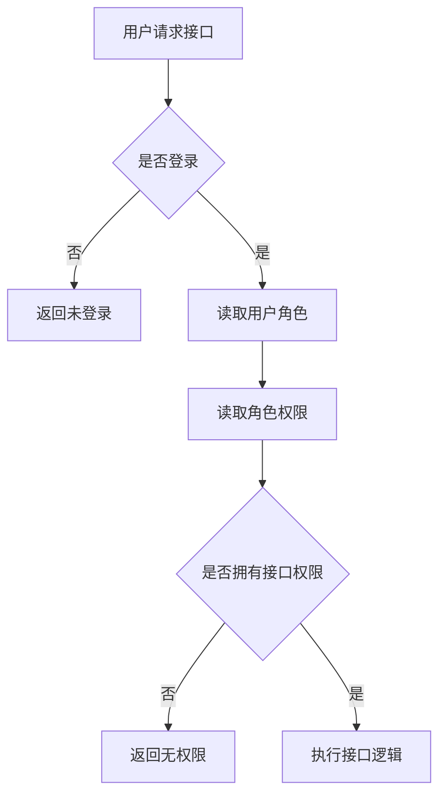
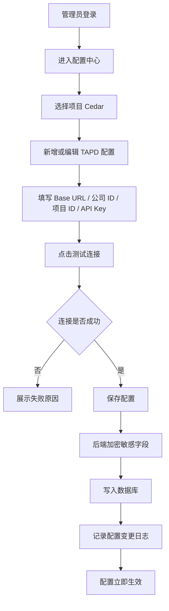
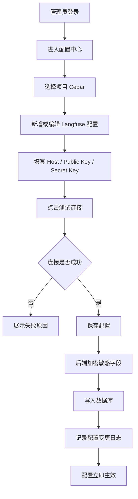
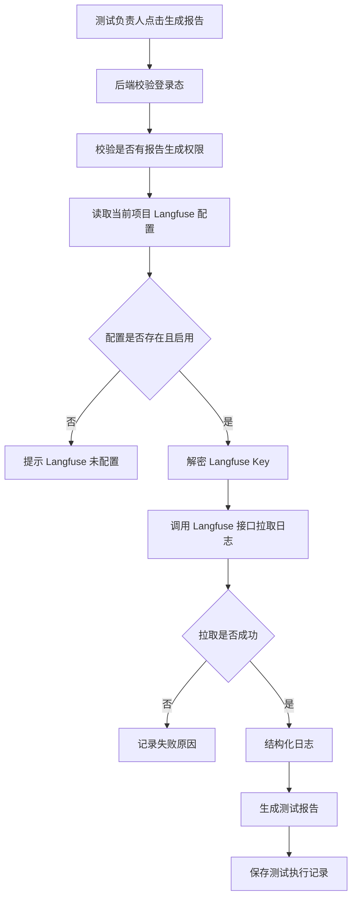

# 语音自助交互工具平台化与敏感配置安全治理方案

## 当前落地状态（2026-07-24 补充）

昨天已完成第一阶段落地开发，当前实现与本文早期设计稿存在以下差异：

| 模块 | 当前实现 |
|---|---|
| 数据库 | 使用 PostgreSQL，不再按早期设计优先 MySQL |
| 登录认证 | 已新增 `/api/auth/login`、`/api/auth/profile`、`/api/auth/logout` |
| 用户管理 | 已新增 `/api/users`，支持创建系统登录账号 |
| 配置中心 | 已新增 `/api/configs`、`/api/configs/:type`，配置保存到数据库 |
| 配置表 | 使用 `app_config` 表，访问配置接口时自动创建 |
| 默认配置 | 由 `src/config/sensitiveDefaults.js` 维护，通过 `scripts/seedDefaultConfigs.js` 写入数据库 |
| 立即生效 | 页面保存配置后会刷新前端运行时缓存，TAPD 导入、Langfuse 日志环境、钉钉通知立即读取最新配置 |

因此，本文后续关于 MySQL、`system_config` 等内容保留为早期完整规划参考；当前部署和联调应以 PostgreSQL、`app_config` 和后端配置接口为准。

## 一、方案背景

当前语音自助交互工具已经完成用例导入、测试音频生成、自动唤醒、自动播放测试音频、日志下载与报告生成等主流程能力，并已经部署到服务器参与日常测试。

随着工具使用频率提升，当前架构暴露出以下问题：

1. 工具缺少登录控制，任何能访问服务地址的人都可能使用工具。
2. TAPD API Key、Langfuse Key 等敏感数据如果写死在代码中，存在泄露风险。
3. Key 发生变化后，需要手动改代码、重新打包、重新部署，维护成本较高。
4. TAPD、Langfuse 等外部系统配置缺少统一管理入口。
5. 多人使用时，缺少用户、角色、权限、配置变更记录，问题难以追溯。
6. 后续接入豆包 TTS/STT、邮件服务、更多测试项目时，继续硬编码配置会进一步增加维护风险。

因此，本方案目标是将语音自助交互工具从“单一测试工具”升级为“支持登录、权限、配置、安全、审计的平台化测试工具”。

---

## 二、方案目标

本次重构目标如下：

| 目标 | 说明 |
|---|---|
| 增加登录能力 | 用户登录后才能使用工具 |
| 增加角色权限 | 角色分为管理员、测试负责人，并分配不同功能权限 |
| 配置中心化 | TAPD、Langfuse 等配置通过页面维护 |
| 敏感数据加密 | TAPD Key、Langfuse Key、公司 ID、项目 ID 等敏感数据加密存储 |
| Key 变更免发版 | Key 修改后无需改代码、无需重新部署 |
| 配置可校验 | 支持 TAPD、Langfuse 配置测试连接 |
| 操作可追溯 | 记录配置修改人、修改时间、操作结果 |
| 支持后续扩展 | 后续可继续纳入豆包 TTS/STT、邮件服务、设备配置等 |

---

## 三、方案意义

### 1. 提升工具安全性

通过登录控制、角色权限和敏感配置加密，避免工具被未授权人员使用，也避免 TAPD、Langfuse 等系统的 Key 暴露在代码、日志或前端接口中。

### 2. 降低配置维护成本

TAPD API Key、Langfuse Secret Key 等信息改为页面配置，Key 变更后只需要在页面更新配置，不需要修改代码、重新打包或重新部署。

### 3. 提高工具平台化能力

通过数据库保存用户、角色、项目、配置和测试记录，使工具从单机化脚本工具升级为可以多人协作、长期维护的内部测试平台。

### 4. 支撑后续功能扩展

后续接入豆包 TTS/STT、多音色多语种、企业邮箱自动发送报告、更多项目配置时，可以复用统一的配置中心和权限体系，避免重复开发。

### 5. 方便问题追溯

通过操作日志和配置变更记录，可以追踪谁在什么时候修改了 TAPD 或 Langfuse 配置，便于排查配置错误、Key 失效、报告生成失败等问题。

---

## 四、整体架构设计

```text
用户浏览器
   │
   ▼
前端 Web
   ├── 登录页
   ├── 工具首页
   ├── 用户管理
   ├── 角色权限
   ├── 项目管理
   ├── TAPD 配置
   ├── Langfuse 配置
   ├── 语音测试执行
   └── 测试报告
   │
   ▼
后端服务
   ├── 登录认证模块
   ├── 角色权限模块
   ├── 项目管理模块
   ├── 敏感配置管理模块
   ├── TAPD 接口适配模块
   ├── Langfuse 日志拉取模块
   ├── 语音测试执行模块
   ├── 报告生成模块
   └── 操作审计模块
   │
   ▼
数据库 MySQL
   ├── 用户信息
   ├── 角色信息
   ├── 权限信息
   ├── 项目信息
   ├── TAPD 配置
   ├── Langfuse 配置
   ├── 配置变更记录
   ├── 操作日志
   └── 测试执行记录
```

---

## 五、数据库选型

### 推荐数据库：MySQL

| 数据库 | 推荐程度 | 说明 |
|---|---:|---|
| MySQL | 高 | 推荐用于正式环境，适合多人使用和长期维护 |
| SQLite | 中 | 适合本地快速验证，不适合后续多人协作 |
| PostgreSQL | 中高 | 也可使用，但如果团队更熟悉 MySQL，优先 MySQL |
| Redis | 低 | 不适合作为主数据库保存用户和敏感配置 |

本方案推荐使用 MySQL。

---

## 六、角色权限设计

### 1. 角色划分

系统角色分为两类：

| 角色 | 说明 |
|---|---|
| 管理员 | 负责用户管理、项目管理、TAPD/Langfuse 配置、系统维护 |
| 测试负责人 | 负责执行语音测试、生成报告、查看测试结果 |

---

### 2. 权限矩阵

| 功能模块 | 功能点 | 管理员 | 测试负责人 |
|---|---|---:|---:|
| 登录 | 登录系统 | ✅ | ✅ |
| 用户管理 | 新增用户 | ✅ | ❌ |
| 用户管理 | 编辑用户 | ✅ | ❌ |
| 用户管理 | 禁用用户 | ✅ | ❌ |
| 项目管理 | 查看项目 | ✅ | ✅ |
| 项目管理 | 新增项目 | ✅ | ❌ |
| 项目管理 | 编辑项目 | ✅ | ❌ |
| TAPD 配置 | 查看配置状态 | ✅ | ✅ |
| TAPD 配置 | 新增配置 | ✅ | ❌ |
| TAPD 配置 | 修改配置 | ✅ | ❌ |
| TAPD 配置 | 测试连接 | ✅ | ❌ |
| TAPD 配置 | 启用/禁用配置 | ✅ | ❌ |
| Langfuse 配置 | 查看配置状态 | ✅ | ✅ |
| Langfuse 配置 | 新增配置 | ✅ | ❌ |
| Langfuse 配置 | 修改配置 | ✅ | ❌ |
| Langfuse 配置 | 测试连接 | ✅ | ❌ |
| Langfuse 配置 | 启用/禁用配置 | ✅ | ❌ |
| 语音测试 | 执行测试 | ✅ | ✅ |
| 语音测试 | 查看执行进度 | ✅ | ✅ |
| 测试报告 | 生成报告 | ✅ | ✅ |
| 测试报告 | 查看报告 | ✅ | ✅ |
| 测试记录 | 查看执行记录 | ✅ | ✅ |
| 操作日志 | 查看操作日志 | ✅ | ❌ |

---

## 七、敏感配置管理设计

### 1. 配置管理原则

1. 所有敏感数据不允许写死在代码中。
2. 所有敏感数据不允许明文存储在数据库中。
3. 前端不展示完整 Key，只展示脱敏结果。
4. 后端接口不返回完整 Key。
5. 日志中不打印完整 Key。
6. 配置修改需要记录操作人和修改时间。
7. 配置修改后应立即生效，无需重启服务。

---

### 2. TAPD 配置项

| 配置项 | 是否敏感 | 说明 |
|---|---:|---|
| 配置名称 | 否 | 例如 Cedar TAPD 配置 |
| TAPD Base URL | 否 | TAPD 服务地址 |
| Workspace ID | 否 | 工作区 ID |
| 公司 ID | 是 | 敏感数据，需要加密保存 |
| TAPD 项目 ID | 是 | 敏感数据，需要加密保存 |
| API Key | 是 | TAPD 接口调用凭证 |
| API Secret/Password | 是 | TAPD 接口密钥或密码 |
| 默认测试计划 ID | 否 | 可选配置 |
| 请求超时时间 | 否 | 例如 10 秒 |
| 是否启用 | 否 | 启用/禁用 |

---

### 3. Langfuse 配置项

| 配置项 | 是否敏感 | 说明 |
|---|---:|---|
| 配置名称 | 否 | 例如 Cedar Langfuse 配置 |
| Langfuse Host | 否 | Langfuse 服务地址 |
| Public Key | 是 | 接口认证使用 |
| Secret Key | 是 | 接口认证使用 |
| Project ID | 建议作为敏感项 | Langfuse 项目标识 |
| 默认查询时间范围 | 否 | 例如最近 1 小时 |
| 最大拉取数量 | 否 | 防止日志量过大 |
| 请求超时时间 | 否 | 防止接口卡死 |
| 是否启用 | 否 | 启用/禁用 |

---

## 八、敏感数据加密方案

### 1. 加密方式

推荐使用 AES-256-GCM 对敏感配置进行加密。

```text
管理员页面输入敏感配置
        │
        ▼
后端接收配置
        │
        ▼
后端使用 Master Key 加密
        │
        ▼
加密后的密文写入数据库
        │
        ▼
前端只展示脱敏后的字段
```

---

### 2. Master Key 管理

| 数据 | 存放位置 |
|---|---|
| TAPD API Key | 数据库，加密存储 |
| TAPD API Secret | 数据库，加密存储 |
| TAPD 公司 ID | 数据库，加密存储 |
| TAPD 项目 ID | 数据库，加密存储 |
| Langfuse Public Key | 数据库，加密存储 |
| Langfuse Secret Key | 数据库，加密存储 |
| Master Key | 服务器环境变量 |
| 用户密码 | 数据库存 Hash，不存明文 |

服务器环境变量示例：

```bash
CONFIG_MASTER_KEY=xxxxxxxxxxxxxxxxxxxxxxxx
```

---

### 3. TAPD 配置存储示例

#### normal_config：非敏感配置

```json
{
  "workspaceId": "61252348",
  "defaultTestPlanId": "1161252348001008513",
  "timeout": 10000
}
```

#### secret_config：敏感配置，加密前结构

```json
{
  "companyId": "company_xxxx",
  "tapdProjectId": "project_xxxx",
  "apiKey": "tapd_api_key_xxxx",
  "apiSecret": "tapd_api_secret_xxxx"
}
```

数据库实际保存的是加密后的密文。

#### secret_mask：前端脱敏展示

```json
{
  "companyId": "company_****1234",
  "tapdProjectId": "project_****5678",
  "apiKey": "tapd_****9a2c",
  "apiSecret": "****"
}
```

---

### 4. Langfuse 配置存储示例

#### normal_config：非敏感配置

```json
{
  "defaultTimeRange": "1h",
  "maxLimit": 1000,
  "timeout": 30000
}
```

#### secret_config：敏感配置，加密前结构

```json
{
  "publicKey": "pk-lf-xxxx",
  "secretKey": "sk-lf-xxxx",
  "projectId": "langfuse_project_xxxx"
}
```

数据库实际保存的是加密后的密文。

---

## 九、数据库表设计

### 1. users：用户表

| 字段 | 类型 | 说明 |
|---|---|---|
| id | bigint | 用户 ID |
| username | varchar | 用户名 |
| password_hash | varchar | 密码 Hash |
| real_name | varchar | 姓名 |
| status | varchar | enabled/disabled |
| last_login_at | datetime | 最近登录时间 |
| created_at | datetime | 创建时间 |
| updated_at | datetime | 更新时间 |

---

### 2. roles：角色表

| 字段 | 类型 | 说明 |
|---|---|---|
| id | bigint | 角色 ID |
| role_code | varchar | 角色编码 |
| role_name | varchar | 角色名称 |
| description | text | 角色说明 |
| created_at | datetime | 创建时间 |
| updated_at | datetime | 更新时间 |

初始化角色：

| role_code | role_name |
|---|---|
| admin | 管理员 |
| test_lead | 测试负责人 |

---

### 3. permissions：权限表

| 字段 | 类型 | 说明 |
|---|---|---|
| id | bigint | 权限 ID |
| permission_code | varchar | 权限编码 |
| permission_name | varchar | 权限名称 |
| module | varchar | 所属模块 |
| description | text | 权限说明 |

权限示例：

| permission_code | permission_name |
|---|---|
| user_manage | 用户管理 |
| project_view | 查看项目 |
| project_manage | 项目管理 |
| config_view | 查看配置状态 |
| config_manage | 配置管理 |
| config_test | 配置测试连接 |
| test_execute | 执行测试 |
| report_generate | 生成报告 |
| report_view | 查看报告 |
| operation_log_view | 查看操作日志 |

---

### 4. user_roles：用户角色关系表

| 字段 | 类型 | 说明 |
|---|---|---|
| id | bigint | ID |
| user_id | bigint | 用户 ID |
| role_id | bigint | 角色 ID |
| created_at | datetime | 创建时间 |

第一阶段建议一个用户只分配一个角色，表结构保留多角色扩展能力。

---

### 5. role_permissions：角色权限关系表

| 字段 | 类型 | 说明 |
|---|---|---|
| id | bigint | ID |
| role_id | bigint | 角色 ID |
| permission_id | bigint | 权限 ID |
| created_at | datetime | 创建时间 |

---

### 6. projects：项目表

| 字段 | 类型 | 说明 |
|---|---|---|
| id | bigint | 工具内部项目 ID |
| name | varchar | 项目名称，例如 Cedar |
| code | varchar | 项目标识，例如 cedar |
| description | text | 项目说明 |
| status | varchar | enabled/disabled |
| created_at | datetime | 创建时间 |
| updated_at | datetime | 更新时间 |

示例数据：

| id | name | code |
|---:|---|---|
| 1 | Cedar | cedar |
| 2 | Speaker | speaker |
| 3 | 魔童 | motong |

---

### 7. secret_configs：敏感配置表

| 字段 | 类型 | 说明 |
|---|---|---|
| id | bigint | 配置 ID |
| local_project_id | bigint | 工具内部项目 ID |
| config_type | varchar | TAPD/LANGFUSE/DOUBAO_TTS/DOUBAO_STT |
| config_name | varchar | 配置名称 |
| base_url | varchar | 服务地址 |
| normal_config | json | 非敏感配置 |
| secret_config | text | 加密后的敏感配置 |
| secret_mask | json | 脱敏展示内容 |
| enabled | boolean | 是否启用 |
| version | int | 配置版本 |
| last_check_status | varchar | SUCCESS/FAILED/UNKNOWN |
| last_check_message | text | 最近校验信息 |
| last_check_at | datetime | 最近校验时间 |
| created_by | bigint | 创建人 |
| updated_by | bigint | 修改人 |
| created_at | datetime | 创建时间 |
| updated_at | datetime | 更新时间 |

说明：

- 使用 `local_project_id` 表示工具内部项目 ID。
- TAPD 的项目 ID 使用 `tapdProjectId`，保存在加密后的 `secret_config` 中。
- 这样可以避免工具内部项目 ID 和 TAPD 项目 ID 混淆。

---

### 8. config_change_logs：配置变更日志表

| 字段 | 类型 | 说明 |
|---|---|---|
| id | bigint | 日志 ID |
| config_id | bigint | 配置 ID |
| local_project_id | bigint | 工具内部项目 ID |
| config_type | varchar | 配置类型 |
| operator_id | bigint | 操作人 |
| action | varchar | create/update/disable/enable/delete/test |
| change_summary | text | 变更摘要 |
| ip_address | varchar | 操作 IP |
| created_at | datetime | 操作时间 |

注意：变更摘要中不能记录完整 Key。

---

### 9. test_runs：测试执行记录表

| 字段 | 类型 | 说明 |
|---|---|---|
| id | bigint | 测试执行 ID |
| local_project_id | bigint | 工具内部项目 ID |
| test_plan_id | varchar | TAPD 测试计划 ID |
| executor_id | bigint | 执行人 |
| status | varchar | running/success/failed |
| total_cases | int | 用例总数 |
| executed_cases | int | 已执行用例数 |
| passed_cases | int | 通过数 |
| failed_cases | int | 失败数 |
| report_path | varchar | 报告文件路径 |
| started_at | datetime | 开始时间 |
| finished_at | datetime | 结束时间 |
| created_at | datetime | 创建时间 |

---

### 10. operation_logs：操作日志表

| 字段 | 类型 | 说明 |
|---|---|---|
| id | bigint | 日志 ID |
| user_id | bigint | 操作人 |
| module | varchar | 模块，例如 auth/config/test_run/report |
| action | varchar | 操作，例如 login/create/update/delete |
| description | text | 操作描述 |
| ip_address | varchar | IP 地址 |
| result | varchar | success/failed |
| created_at | datetime | 操作时间 |

---

## 十、核心业务流程

### 1. 登录与权限校验流程



---

### 2. TAPD 配置流程



---

### 3. Langfuse 配置流程



---

### 4. 生成测试报告流程



---

## 十一、后端接口设计

### 1. 登录接口

```http
POST /api/auth/login
```

请求：

```json
{
  "username": "admin",
  "password": "123456"
}
```

响应：

```json
{
  "code": 0,
  "message": "登录成功",
  "data": {
    "userId": 1,
    "username": "admin",
    "realName": "管理员",
    "roles": ["admin"],
    "permissions": [
      "user_manage",
      "project_manage",
      "config_view",
      "config_manage",
      "config_test",
      "test_execute",
      "report_generate",
      "report_view",
      "operation_log_view"
    ]
  }
}
```

---

### 2. 获取当前用户信息

```http
GET /api/auth/profile
```

需要登录。

---

### 3. 用户管理接口

```http
GET /api/users
POST /api/users
PUT /api/users/{id}
```

需要权限：

```text
user_manage
```

---

### 4. 项目接口

```http
GET /api/projects
POST /api/projects
PUT /api/projects/{id}
```

查看项目需要：

```text
project_view
```

新增、编辑项目需要：

```text
project_manage
```

---

### 5. 配置查询接口

```http
GET /api/configs?localProjectId=1
```

需要权限：

```text
config_view
```

---

### 6. TAPD 配置保存接口

```http
POST /api/configs/tapd
```

需要权限：

```text
config_manage
```

请求示例：

```json
{
  "localProjectId": 1,
  "configName": "Cedar TAPD 配置",
  "baseUrl": "https://www.tapd.cn",
  "workspaceId": "61252348",
  "companyId": "company_xxxx",
  "tapdProjectId": "project_xxxx",
  "apiKey": "tapd_api_key_xxxx",
  "apiSecret": "tapd_api_secret_xxxx",
  "defaultTestPlanId": "1161252348001008513",
  "timeout": 10000,
  "enabled": true
}
```

---

### 7. Langfuse 配置保存接口

```http
POST /api/configs/langfuse
```

需要权限：

```text
config_manage
```

请求示例：

```json
{
  "localProjectId": 1,
  "configName": "Cedar Langfuse 配置",
  "host": "https://langfuse.xxx.com",
  "publicKey": "pk-lf-xxxx",
  "secretKey": "sk-lf-xxxx",
  "langfuseProjectId": "project_xxxx",
  "defaultTimeRange": "1h",
  "maxLimit": 1000,
  "timeout": 30000,
  "enabled": true
}
```

---

### 8. 配置测试连接接口

```http
POST /api/configs/{id}/test
```

需要权限：

```text
config_test
```

---

### 9. 测试执行接口

```http
POST /api/test-runs/start
GET /api/test-runs/{id}
```

需要权限：

```text
test_execute
```

---

### 10. 报告接口

```http
POST /api/reports/generate
GET /api/reports/{id}
```

生成报告需要：

```text
report_generate
```

查看报告需要：

```text
report_view
```

---

## 十二、前端页面设计

### 1. 管理员菜单

管理员登录后可见：

```text
工具首页
用户管理
项目管理
TAPD 配置
Langfuse 配置
语音测试执行
测试报告
操作日志
```

---

### 2. 测试负责人菜单

测试负责人登录后可见：

```text
工具首页
配置状态
语音测试执行
测试报告
测试执行记录
```

测试负责人不展示：

```text
用户管理
项目管理
TAPD 配置编辑入口
Langfuse 配置编辑入口
操作日志
```

---

### 3. 配置页面展示规则

敏感字段只展示脱敏内容：

```text
公司 ID：company_****1234
TAPD 项目 ID：project_****5678
API Key：tapd_****9a2c
API Secret：****
Langfuse Secret Key：sk-lf-****88fa
```

不允许展示完整 Key。

---

## 十三、代码改造点

### 1. 移除硬编码配置

原方式：

```js
const TAPD_API_KEY = "xxxx";
const LANGFUSE_SECRET_KEY = "xxxx";
```

改造后：

```js
const tapdConfig = await configService.getTapdConfig(localProjectId);
const langfuseConfig = await configService.getLangfuseConfig(localProjectId);
```

---

### 2. TAPD 调用改造

调用 TAPD 前：

```text
1. 根据 localProjectId 查询 TAPD 配置
2. 校验配置是否存在且启用
3. 解密 companyId、tapdProjectId、apiKey、apiSecret
4. 调用 TAPD 接口
5. 获取测试计划和测试用例
```

---

### 3. Langfuse 调用改造

调用 Langfuse 前：

```text
1. 根据 localProjectId 查询 Langfuse 配置
2. 校验配置是否存在且启用
3. 解密 publicKey、secretKey、projectId
4. 调用 Langfuse API
5. 拉取 Trace/Observation 日志
6. 结构化日志
7. 生成测试报告
```

---

## 十四、异常处理设计

| 异常场景 | 处理方式 |
|---|---|
| 用户未登录 | 跳转登录页 |
| 登录过期 | 提示重新登录 |
| 用户无权限 | 提示无权限访问 |
| TAPD 配置不存在 | 提示管理员配置 TAPD |
| Langfuse 配置不存在 | 提示管理员配置 Langfuse |
| TAPD Key 无效 | 提示 Key 无效或权限不足 |
| Langfuse Key 无效 | 提示 Key 无效或权限不足 |
| 配置被禁用 | 阻止调用对应能力 |
| 解密失败 | 标记配置异常，提示重新保存 |
| 接口超时 | 自动重试，失败后记录日志 |
| 数据库连接失败 | 提示系统异常 |
| 多人同时修改配置 | 使用 version 防止覆盖 |
| 配置测试失败 | 展示失败原因，允许重新编辑 |

---

## 十五、上线迁移方案

### 1. 上线前准备

需要准备：

```text
MySQL 数据库地址
数据库账号
数据库密码
CONFIG_MASTER_KEY
初始管理员账号
当前 TAPD 公司 ID
当前 TAPD 项目 ID
当前 TAPD API Key
当前 TAPD API Secret
当前 Langfuse Host
当前 Langfuse Public Key
当前 Langfuse Secret Key
```

---

### 2. 迁移步骤

```text
1. 创建 MySQL 数据库
2. 执行数据库初始化脚本
3. 初始化管理员和测试负责人角色
4. 初始化权限数据
5. 初始化管理员账号
6. 部署登录认证模块
7. 部署角色权限模块
8. 部署配置中心页面
9. 将当前 TAPD 配置录入配置中心
10. 将当前 Langfuse 配置录入配置中心
11. 删除代码中的硬编码 Key
12. 改造 TAPD 调用逻辑
13. 改造 Langfuse 调用逻辑
14. 验证测试计划读取
15. 验证日志拉取
16. 验证测试报告生成
17. 上线
```

---

### 3. 灰度策略

上线初期可以短期保留兜底策略：

```text
优先读取数据库配置
数据库无配置时读取环境变量
环境变量也不存在时提示配置缺失
```

稳定后建议移除环境变量中的业务 Key。

---

## 十六、测试验收标准

### 1. 登录验收

| 测试项 | 预期结果 |
|---|---|
| 未登录访问工具 | 自动跳转登录页 |
| 正确账号密码登录 | 登录成功 |
| 错误密码登录 | 登录失败 |
| 禁用账号登录 | 登录失败 |
| 登录过期后操作 | 提示重新登录 |

---

### 2. 权限验收

| 测试项 | 预期结果 |
|---|---|
| 管理员访问用户管理 | 成功 |
| 测试负责人访问用户管理 | 失败 |
| 管理员修改 TAPD 配置 | 成功 |
| 测试负责人修改 TAPD 配置 | 失败 |
| 管理员修改 Langfuse 配置 | 成功 |
| 测试负责人修改 Langfuse 配置 | 失败 |
| 测试负责人执行语音测试 | 成功 |
| 测试负责人生成报告 | 成功 |
| 测试负责人查看操作日志 | 失败 |

---

### 3. 配置验收

| 测试项 | 预期结果 |
|---|---|
| 新增 TAPD 配置 | 保存成功 |
| 新增 Langfuse 配置 | 保存成功 |
| 错误 Key 测试连接 | 返回失败 |
| 正确 Key 测试连接 | 返回成功 |
| 修改 TAPD Key 后读取测试计划 | 使用新 Key |
| 修改 Langfuse Key 后拉取日志 | 使用新 Key |
| 禁用配置后调用接口 | 阻止调用 |

---

### 4. 安全验收

| 测试项 | 预期结果 |
|---|---|
| 数据库查看 TAPD Key | 只能看到密文 |
| 数据库查看 Langfuse Key | 只能看到密文 |
| 前端查看配置详情 | 只能看到脱敏 Key |
| 浏览器接口返回 | 不包含完整 Key |
| 后端日志搜索 Key | 不出现完整 Key |
| 配置变更日志 | 不记录完整 Key |
| 密码存储 | 不能看到明文密码 |

---

## 十七、实施优先级

### 第一优先级：必须实现

```text
用户登录
角色权限
管理员/测试负责人角色
TAPD 配置中心
Langfuse 配置中心
敏感字段加密
配置脱敏展示
硬编码 Key 移除
配置修改后立即生效
```

---

### 第二优先级：建议实现

```text
配置测试连接
操作日志
配置变更记录
测试执行记录
报告记录
配置异常提示
```

---

### 第三优先级：后续增强

```text
配置版本回滚
企业微信/飞书登录
定期健康检查
豆包 TTS/STT 配置纳入配置中心
邮件服务配置纳入配置中心
多项目配置模板
```

---

## 十八、最终结论

本方案建议将语音自助交互工具重构为：

```text
登录认证
+ 角色权限
+ 数据库配置中心
+ 敏感数据加密
+ 配置脱敏展示
+ TAPD/Langfuse 动态配置
+ 操作审计
+ 测试执行记录
```

重构后，工具将具备以下能力：

| 能力 | 效果 |
|---|---|
| 登录控制 | 用户登录后才能使用工具 |
| 角色权限 | 管理员负责配置，测试负责人负责测试执行和报告 |
| TAPD 配置管理 | 公司 ID、项目 ID、API Key 等敏感配置加密存储 |
| Langfuse 配置管理 | Public Key、Secret Key 等敏感配置加密存储 |
| Key 变更免发版 | 页面修改配置后立即生效 |
| 安全合规 | 敏感数据不进代码、不明文入库、不在前端完整展示 |
| 运维可追溯 | 配置修改、测试执行、报告生成均可追溯 |
| 后续可扩展 | 可继续接入豆包、邮箱、更多测试项目 |

一句话总结：

> 本方案的核心意义是将语音自助交互工具从“依赖代码配置的单点工具”升级为“具备登录权限、配置中心、敏感数据安全治理和可追溯能力的平台化测试工具”，降低维护成本，提升安全性和团队协作效率。
