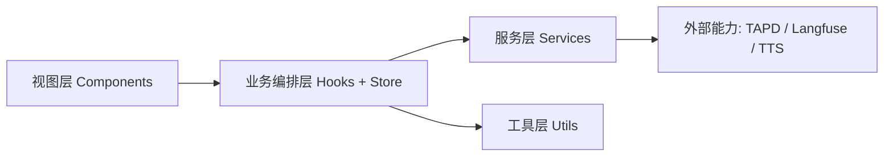
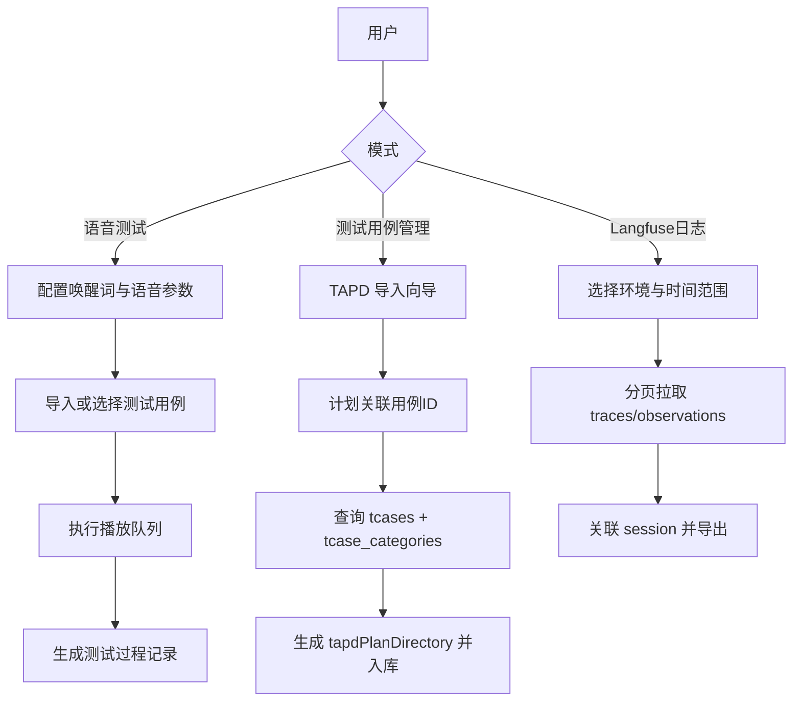
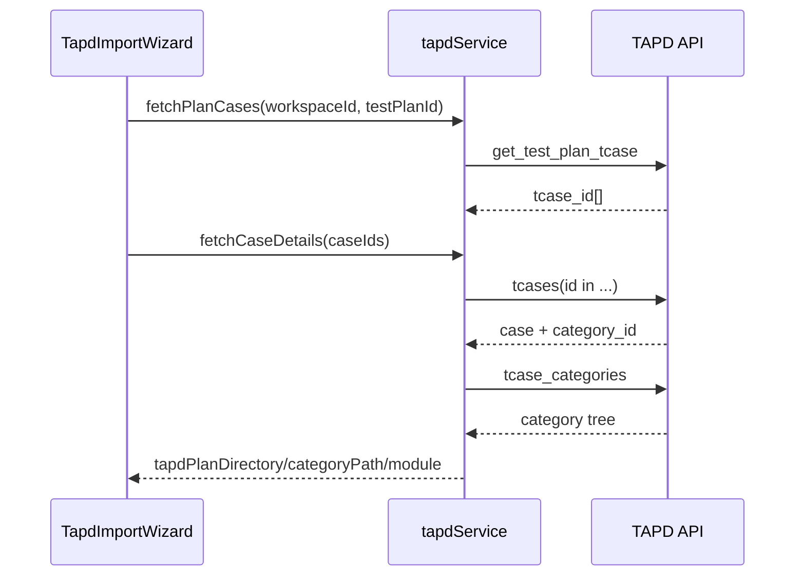

# VoiceAuto 架构文档

## 文档定位

- 目标读者：研发与架构维护人员。
- 内容范围：系统分层、运行链路、状态管理、容错策略、模块边界与演进方向。

## 1. 架构目标

- 低部署成本：纯前端运行，无后端依赖。
- 高操作性：配置、导入、执行、报告在单页内完成。
- 可扩展性：语音引擎、导入方式、日志分析规则可扩展。
- 可恢复性：关键状态落盘 `localStorage`，刷新后可恢复。

## 2. 总体分层

系统采用四层架构：`视图层 -> 业务编排层 -> 服务层 -> 工具层`。



### 2.1 视图层（Components）

- 负责页面展示、交互输入、结果反馈。
- 关键组件：`AudioImporter`、`AudioList`、`PlaybackConsole`、`TestCaseManager`、`TapdImportWizard`、`LangfuseFetcher`。

### 2.2 业务编排层（Hooks + Store）

- `React Context + useReducer` 统一状态管理。
- `useTestRunner`、`useAudioPlayer` 等 Hook 封装执行与播放行为。

### 2.3 服务层（Services）

- `ttsService`：统一语音合成入口（Doubao 优先，Web Speech 回退）。
- `tapdService`：TAPD 计划/用例/目录接口编排。
- `langfuseService`：多环境日志分页拉取。

### 2.4 工具层（Utils）

- 负责纯函数逻辑：文本解析、日志分析、报告生成、导出转换等。

## 3. 运行时主链路



## 4. TAPD 导入架构（目录映射）

为保证“用例目录”与 TAPD 页面一致，当前采用以下稳定链路：

1. `test_plans/get_test_plan_tcase`：获取 `tcase_id` 列表。
2. `tcases`：按 `id` 批量获取用例详情，读取 `category_id`。
3. `tcase_categories`：获取目录表（`id/name/parent_id/path`）。
4. 通过 `category_id -> category.id` 映射目录名称与路径。

导入落库字段：

- `tapdPlanDirectory`：目录文本（主字段）
- `categoryId`：目录 ID
- `categoryPath`：目录路径
- `module`：与 `tapdPlanDirectory` 保持一致



## 5. 状态与持久化架构

核心状态：

- `wakeWord`、`defaultVoiceConfig`
- `testAudios`（含 TAPD 元数据）
- `testOptions`（循环次数、调试开关、模块筛选）
- `playback`、`report`

持久化策略：

- `voiceauto_state`：测试配置与用例信息
- `voiceauto_log_records_v1`：日志记录归档

## 6. 容错与稳定性设计

- 语音容错：Doubao 失败自动回退 Web Speech。
- 播放容错：单条失败不阻断整轮执行。
- 存储容错：`localStorage` 超限时降级保存。
- TAPD 导入容错：分页拉取、批量去重、阶段化报错（清单/详情/导入）。
- Langfuse 拉取容错：支持暂停/继续/终止并保留中间态。

## 7. 模块化目录与演进

目标结构（摘要）：

```text
src/
├── modules/      # langfuse/audio/test/log/config
├── components/   # 共享与页面组件
├── hooks/        # 通用行为
├── stores/       # 全局状态
├── services/     # 公共服务
└── utils/        # 通用工具
```

演进原则：

- 模块内保持 `services/utils/components` 分层。
- 跨模块调用优先通过模块 `index.js` 导出入口。
- 新能力优先落在对应模块，避免全局散落。