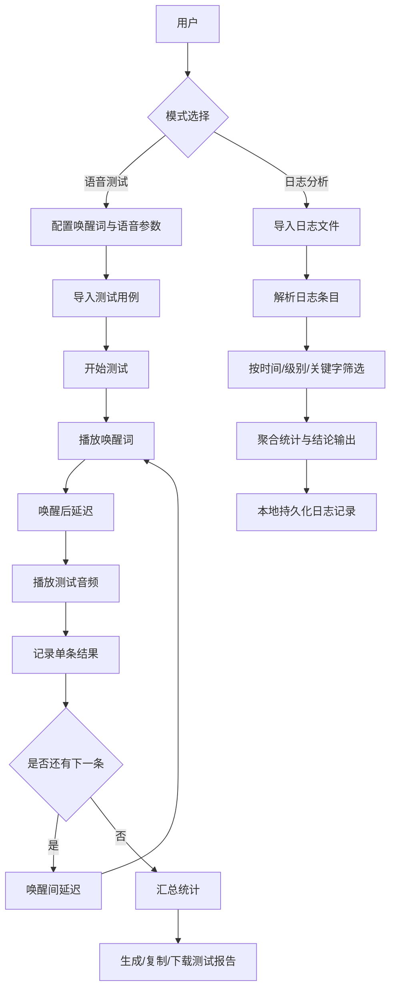

# VoiceAuto 架构文档

## 1. 架构目标

VoiceAuto 采用纯前端架构，聚焦语音测试与日志分析两条主流程，核心目标如下：

- 低部署成本：无后端依赖，浏览器即可运行。
- 高可操作性：配置、导入、执行、报告在单页完成。
- 可扩展性：语音引擎、导入方式、分析规则可逐步扩展。
- 可恢复性：关键状态落盘 localStorage，刷新后可继续使用。

## 2. 总体架构

系统按「视图层 -> 业务编排层 -> 领域服务层 -> 工具层」组织：

1. 视图层（Components）
- 负责页面展示、交互输入、结果展示。
- 包含语音测试模式与日志分析模式。

2. 业务编排层（Hooks + Store）
- 使用 React Context + useReducer 统一状态。
- 通过自定义 Hook 封装流程控制（例如测试执行、试听播放、分页、选择）。

3. 领域服务层（Services）
- 语音合成统一由 ttsService 管理。
- 支持 Doubao TTS 与 Web Speech API 回退机制。

4. 工具层（Utils）
- 承担文件解析、音频辅助、日志解析、报告文本生成、格式化等纯函数能力。

## 3. 目录分层说明

- src/components
  - 业务界面组件：WakeWordConfig、VoiceConfig、AudioImporter、AudioList、PlaybackConsole、TestReport、LogAnalyzer
- src/hooks
  - 业务行为 Hook：useTestRunner、useAudioPlayer、usePagination、useSelection
- src/stores
  - 全局状态：testStore（Context + Reducer + Actions）
- src/services
  - 外部能力接入：ttsService
- src/utils
  - 通用工具：音频处理、日志分析、报告生成、格式化
- src/constants
  - 配置常量：音色、语种、分页大小等

## 4. 运行时架构与主链路

### 4.1 应用入口

- App.jsx 作为页面壳层，使用 TestProvider 注入全局状态。
- 顶部模式切换：
  - 语音测试模式（Voice Test）
  - 日志分析模式（Log Analyzer）

### 4.2 语音测试链路

1. 配置阶段
- WakeWordConfig 设置唤醒词和两段延迟。
- VoiceConfig 设置音色、语种、音量、倍速。

2. 用例准备阶段
- AudioImporter 支持文本导入、音频文件导入、手动输入。
- AudioList 支持筛选、试听、分页、批量删除。

3. 执行阶段
- PlaybackConsole 触发 useTestRunner.start()。
- useTestRunner 采用“预生成播放队列 + 单游标遍历”编排执行，避免轮次切换时重复播放。
- 支持循环播放次数配置（当前 UI 支持 1/2/3/5/10/20/50 次）。
- 每个播放项执行步骤：
  - 播放唤醒词
  - wakeAfterDelay 等待
  - 播放测试音频
  - 记录报告项（成功/失败）
  - wakeIntervalDelay 等待（最后一项不等待）
- 支持暂停、继续、停止、重置与快捷键控制。
- 提供运行令牌（runId）防重入机制，避免并发启动导致重复播放。
- 提供调试日志开关（debugSequence），可在控制台输出实际播放序列（如 1-1, 1-2, 2-1）。

4. 结果阶段
- TestReport 从 store.report 读取统计与明细。
- 支持复制文本报告、下载 txt 报告。
- 测试进行中允许查看报告，不会卸载播放控制链路，不打断音频播放。

### 4.3 日志分析链路

1. LogAnalyzer 导入日志文件（按文本读取）。
2. parseLogContent 将非结构化日志解析为统一条目。
3. analyzeLogEntries 聚合统计：级别分布、模块分布、峰值秒、错误率、结论。
4. UI 侧支持按记录、时间、关键字、级别筛选，并展示分析结果。
5. 分析记录持久化至 localStorage，容量不足时自动降级（只保留元数据或裁剪条目）。

### 4.4 业务逻辑图

图示说明：

- 语音测试链路是循环执行模型，循环体为“唤醒词 -> 延迟 -> 测试音频 -> 结果记录”。
- 日志分析链路是单次导入、多次筛选模型，核心价值在于快速定位异常模块与高峰时间段。

## 5. 状态管理架构

### 5.1 Store 结构

testStore 的核心状态包含：

- wakeWord：唤醒词文本与延迟配置
- defaultVoiceConfig：默认语音配置
- testAudios：测试用例列表
- testOptions：测试选项（loopCount、debugSequence）
- playback：当前执行状态
  - currentIndex：当前在总队列中的索引
  - currentListIndex：当前在原始用例列表中的索引
- report：测试报告聚合结果

### 5.2 状态流

- 组件触发 action。
- reducer 进行不可变更新。
- TestProvider 将关键配置与用例写入 localStorage。
- 页面刷新后从 localStorage 恢复配置和用例。

### 5.3 播放状态机（简化）

- idle -> playing -> paused -> playing -> completed
- 任意执行态可进入 stop（重置到 idle 的表现）

## 6. 语音服务架构

ttsService 是语音能力统一入口：

- speak(text, config)
  - 若 provider=doubao，优先调用 speakWithDoubao
  - Doubao 失败自动 fallback 到 speakWithWebSpeech
- stopAudio()
  - 统一停止 HTMLAudio 与 speechSynthesis

该设计保证：

- 上层组件不感知引擎差异
- 语音供应商切换成本低
- 出错时具备降级可用性

## 7. 关键工具能力

- audioHelpers / audioUtils
  - 音频播放、文件读取、用例解析、时长格式化
- reportGenerator
  - 生成可读文本报告
- logAnalysis
  - 日志解析、聚合分析、时间与大小格式化
- formatters
  - 通用格式化能力

## 8. 持久化与缓存策略

1. 测试配置与用例
- key: voiceauto_state
- 保存项：唤醒词、语音配置、测试选项（循环次数/调试开关）、测试用例基础信息

2. 日志记录
- key: voiceauto_log_records_v1
- 限制记录数量与条目数量，避免超出浏览器配额
- 写入失败时自动降级，防止页面崩溃

## 9. 异常与容错设计

- 语音引擎容错：Doubao 异常自动回退 Web Speech。
- 本地存储容错：Quota 超限时降级保存并提示。
- 播放流程容错：单条播放异常不阻断整体流程（记录并继续）。
- 解析容错：日志时间戳识别失败仍保留原始文本参与统计。

## 10. 当前架构优势与限制

优势：

- 结构清晰，职责分层明显。
- Hook 抽离后可测试性、复用性更好。
- 纯前端交付快，便于本地测试团队使用。

限制：

- 缺少后端任务系统，无法进行长任务统一调度与集中存档。
- 报告当前以 txt 为主，缺少结构化对接能力。
- 大日志分析受浏览器性能与存储上限约束。

## 11. 演进建议

- 引入任务执行队列与可取消令牌，增强并发和中断控制。
- 增加报告 JSON/CSV 导出，便于外部系统消费。
- 增加日志规则引擎（自定义告警阈值与模式）。
- 可选引入后端服务实现历史报告归档与跨端共享。
- 针对 useTestRunner 增加更细粒度结果状态（成功/失败/跳过/中断）。

## 12. 当日变更（2026-04-22）

- 修复循环播放在第 2 轮起可能出现同一用例连续播放的问题。
- 新增循环播放次数配置，并将可选上限扩展至 50 次。
- 新增播放序列调试日志开关，可输出实际执行序列到浏览器控制台。
- 修复“测试中查看报告会打断播放”的问题，支持测试过程中查看报告预览。
- 修复“查看报告后内容空白”问题，报告面板改为稳定渲染，空数据时显示占位提示。
