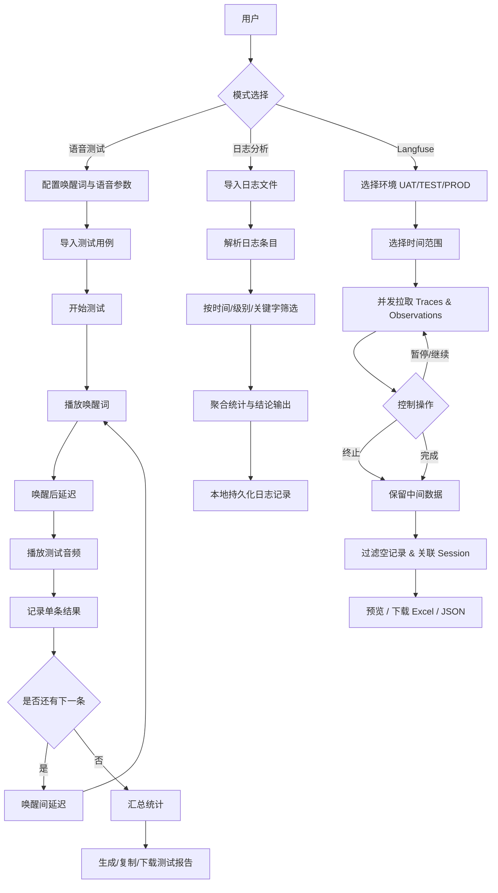

# VoiceAuto 架构文档

## 文档定位

- 目标读者：研发与架构维护人员。
- 内容范围：系统分层、运行链路、状态管理、容错策略、模块迁移与协作约定。

## 1. 架构目标

VoiceAuto 采用纯前端架构，聚焦语音测试与日志分析两条主流程，核心目标如下：

- 低部署成本：无后端依赖，浏览器即可运行。
- 高可操作性：配置、导入、执行、报告在单页完成。
- 可扩展性：语音引擎、导入方式、分析规则可逐步扩展。
- 可恢复性：关键状态落盘 localStorage，刷新后可继续使用。

## 2. 总体架构

系统按「视图层 -> 业务编排层 -> 领域服务层 -> 工具层」组织：

1. 视图层（Components）
- 负责页面展示、交互输入、结果展示。
- 包含语音测试模式与日志分析模式。

2. 业务编排层（Hooks + Store）
- 使用 React Context + useReducer 统一状态。
- 通过自定义 Hook 封装流程控制（例如测试执行、试听播放、分页、选择）。

3. 领域服务层（Services）
- 语音合成统一由 ttsService 管理。
- 支持 Doubao TTS 与 Web Speech API 回退机制。
- Langfuse 数据拉取由 langfuseService 管理，封装分页、鉴权、控制器。

4. 工具层（Utils）
- 承担文件解析、音频辅助、日志解析、报告文本生成、格式化等纯函数能力。

## 3. 目录分层说明

- src/components
  - 业务界面组件：WakeWordConfig、VoiceConfig、AudioImporter、AudioList、PlaybackConsole、TestReport、LogAnalyzer、**LangfuseFetcher**
- src/hooks
  - 业务行为 Hook：useTestRunner、useAudioPlayer、usePagination、useSelection
- src/stores
  - 全局状态：testStore（Context + Reducer + Actions）
- src/services
  - 外部能力接入：ttsService、**langfuseService**（多环境 Langfuse API）
- src/utils
  - 通用工具：音频处理、日志分析、报告生成、格式化、**excelExport（Excel/JSON 导出）**
- src/constants
  - 配置常量：音色、语种、分页大小等

## 4. 运行时架构与主链路

### 4.1 应用入口

- App.jsx 作为页面壳层，使用 TestProvider 注入全局状态。
- 顶部模式切换：
  - 语音测试模式（Voice Test）
  - 测试过程记录模式（Test Report）
  - Langfuse 日志获取模式（Langfuse 日志）

### 4.2 语音测试链路

1. 配置阶段
- WakeWordConfig 设置唤醒词和两段延迟。
- VoiceConfig 设置音色、语种、音量、倍速。

2. 用例准备阶段
- AudioImporter 支持文本导入、音频文件导入、手动输入。
- AudioList 支持筛选、试听、分页、批量删除。

3. 执行阶段
- PlaybackConsole 触发 useTestRunner.start()。
- useTestRunner 采用“预生成播放队列 + 单游标遍历”编排执行，避免轮次切换时重复播放。
- 支持循环播放次数配置（当前 UI 支持 1/2/3/5/10/20/50 次）。
- 每个播放项执行步骤：
  - 播放唤醒词
  - wakeAfterDelay 等待
  - 播放测试音频
  - 记录报告项（成功/失败）
  - wakeIntervalDelay 等待（最后一项不等待）
- 支持暂停、继续、停止、重置与快捷键控制。
- 提供运行令牌（runId）防重入机制，避免并发启动导致重复播放。
- 提供调试日志开关（debugSequence），可在控制台输出实际播放序列（如 1-1, 1-2, 2-1）。

4. 结果阶段
- TestReport 从 store.report 读取统计与明细。
- 支持复制文本报告、下载 txt 报告。
- 测试进行中允许查看报告，不会卸载播放控制链路，不打断音频播放。

### 4.3 日志分析链路

1. LogAnalyzer 导入日志文件（按文本读取）。
2. parseLogContent 将非结构化日志解析为统一条目。
3. analyzeLogEntries 聚合统计：级别分布、模块分布、峰值秒、错误率、结论。
4. UI 侧支持按记录、时间、关键字、级别筛选，并展示分析结果。
5. 分析记录持久化至 localStorage，容量不足时自动降级（只保留元数据或裁剪条目）。

### 4.4 Langfuse 日志获取链路

1. LangfuseFetcher 标题栏提供环境切换器（UAT / TEST / PROD），切换时重置数据状态。
2. 用户选择时间范围后点击"获取日志"，实例化 FetchController 并启动拉取。
3. `fetchTraces` 与 `fetchObservations` 并发执行，各自分页拉取，实时上报进度。
4. `FetchController` 统一管理暂停 / 继续 / 终止，终止时直接读取中间态数据。
5. `processData` 过滤空记录并关联 Traces ↔ Observations 的 SessionID。
6. 结果展示统计卡片、Session 列表、表格预览，支持 Excel / JSON 下载。

**Vite 代理配置：**

| 前缀路径 | 目标环境 | 说明 |
|---|---|---|
| `/langfuse-api-uat` | UAT Langfuse | 紫色标识 |
| `/langfuse-api-test` | TEST Langfuse | 黄色标识 |
| `/langfuse-api-prod` | PROD Langfuse | 红色标识 |

所有代理均设置 `changeOrigin: true`，路径重写后转发到目标地址，避免浏览器 CORS 限制。



图示说明：

- 语音测试链路是循环执行模型，循环体为"唤醒词 -> 延迟 -> 测试音频 -> 结果记录"。
- 日志分析链路是单次导入、多次筛选模型，核心价值在于快速定位异常模块与高峰时间段。
- Langfuse 链路是按需拉取模型，支持多环境切换和中途终止，核心价值在于导出平台侧请求数据。

## 5. 状态管理架构

### 5.1 Store 结构

testStore 的核心状态包含：

- wakeWord：唤醒词文本与延迟配置
- defaultVoiceConfig：默认语音配置
- testAudios：测试用例列表
- testOptions：测试选项（loopCount、debugSequence）
- playback：当前执行状态
  - currentIndex：当前在总队列中的索引
  - currentListIndex：当前在原始用例列表中的索引
- report：测试报告聚合结果

### 5.2 状态流

- 组件触发 action。
- reducer 进行不可变更新。
- TestProvider 将关键配置与用例写入 localStorage。
- 页面刷新后从 localStorage 恢复配置和用例。

### 5.3 播放状态机（简化）

- idle -> playing -> paused -> playing -> completed
- 任意执行态可进入 stop（重置到 idle 的表现）

## 6. 语音服务架构

ttsService 是语音能力统一入口：

- speak(text, config)
  - 若 provider=doubao，优先调用 speakWithDoubao
  - Doubao 失败自动 fallback 到 speakWithWebSpeech
- stopAudio()
  - 统一停止 HTMLAudio 与 speechSynthesis

该设计保证：

- 上层组件不感知引擎差异
- 语音供应商切换成本低
- 出错时具备降级可用性

## 7. 关键工具能力

- audioHelpers / audioUtils
  - 音频播放、文件读取、用例解析、时长格式化
- reportGenerator
  - 生成可读文本报告
- logAnalysis
  - 日志解析、聚合分析、时间与大小格式化
- formatters
  - 通用格式化能力
- excelExport
  - Langfuse 数据导出：xlsx 多 Sheet Excel、JSON Blob 下载
  - flattenObject 展平嵌套 JSON 结构，适配表格列展示

## 8. 持久化与缓存策略

1. 测试配置与用例
- key: voiceauto_state
- 保存项：唤醒词、语音配置、测试选项（循环次数/调试开关）、测试用例基础信息

2. 日志记录
- key: voiceauto_log_records_v1
- 限制记录数量与条目数量，避免超出浏览器配额
- 写入失败时自动降级，防止页面崩溃

## 9. 异常与容错设计

- 语音引擎容错：Doubao 异常自动回退 Web Speech。
- 本地存储容错：Quota 超限时降级保存并提示。
- 播放流程容错：单条播放异常不阻断整体流程（记录并继续）。
- 解析容错：日志时间戳识别失败仍保留原始文本参与统计。
- Langfuse 拉取容错：任意页请求失败抛出错误，状态置为 error，已拉取数据通过中间态 ref 保留；用户可通过"终止并保留"提前结束。

## 10. 当前架构优势与限制

优势：

- 结构清晰，职责分层明显。
- Hook 抽离后可测试性、复用性更好。
- 纯前端交付快，便于本地测试团队使用。

限制：

- 缺少后端任务系统，无法进行长任务统一调度与集中存档。
- 报告当前以 txt 为主，缺少结构化对接能力。
- 大日志分析受浏览器性能与存储上限约束。
- Langfuse 代理依赖 Vite Dev Server，生产部署需另配反向代理规则。

## 11. 演进建议

- 引入任务执行队列与可取消令牌，增强并发和中断控制。
- 增加报告 JSON/CSV 导出，便于外部系统消费。
- 增加日志规则引擎（自定义告警阈值与模式）。
- 可选引入后端服务实现历史报告归档与跨端共享。
- 针对 useTestRunner 增加更细粒度结果状态（成功/失败/跳过/中断）。

## 12. 模块化目录与迁移策略（已从根目录架构文档同步）

### 12.1 目录结构（模块化目标形态）

```text
src/
├── modules/                    # 功能模块（按业务域组织）
│   ├── langfuse/               # Langfuse 日志获取和导出
│   │   ├── services/
│   │   │   └── langfuseService.js
│   │   ├── utils/
│   │   │   ├── sessionExtractor.js
│   │   │   └── excelExporter.js
│   │   ├── components/         # 逐步迁移中
│   │   └── index.js
│   ├── audio/
│   │   ├── utils/              # audioHelpers.js, audioUtils.jsx
│   │   ├── components/
│   │   └── index.js
│   ├── test/
│   │   ├── utils/              # reportGenerator.js
│   │   ├── components/
│   │   ├── hooks/              # useTestRunner（可选迁移）
│   │   └── index.js
│   ├── log/
│   │   ├── utils/              # logAnalysis.js
│   │   ├── components/
│   │   └── index.js
│   └── config/
│       ├── utils/              # formatters.js
│       ├── components/
│       └── index.js
├── common/
│   └── utils/                  # fileHelpers.js
├── hooks/                      # 跨模块通用 Hook
├── components/                 # 共享 UI 组件
├── services/                   # 共享服务
├── stores/                     # 全局状态
├── constants/                  # 全局常量
├── App.jsx
├── main.jsx
└── index.css
```

### 12.2 架构原则

1. 模块隔离
- 功能按业务域组织在 `modules/` 下。
- 每个模块保持 `services/`、`utils/`、`components/` 分层结构。
- 模块间通信优先通过 `index.js` 导出入口完成。

2. 分层设计
- Services：数据获取与 API 调用。
- Utils：业务逻辑与数据处理。
- Components：UI 展示。
- Hooks：可复用状态逻辑。

3. 迁移策略
- 已迁移：
  - `src/services/langfuseService.js` -> `src/modules/langfuse/services/langfuseService.js`
  - `src/utils/excelExport.js` -> `src/modules/langfuse/utils/sessionExtractor.js` + `src/modules/langfuse/utils/excelExporter.js`
- 待按需迁移：
  - 音频相关 -> `modules/audio/`
  - 测试相关 -> `modules/test/`
  - 日志相关 -> `modules/log/`
  - 配置相关 -> `modules/config/`

4. 导入规范
- 推荐从模块入口导入，避免跨层级路径耦合。
- 示例：

```javascript
import { fetchTraces, exportToExcel } from '../modules/langfuse';
```

### 12.3 后续优化方向

1. 在模式或路由层增加懒加载，实现按需加载。
2. 为模块补齐类型定义（JSDoc 或 TypeScript）。
3. 为模块补齐测试目录（`__tests__/`）。
4. 为模块补齐 README（对外 API 与使用示例）。
5. 评估共享 UI 的沉淀路径（`components/common/` 或独立组件库）。

### 12.4 开发规范补充

1. 模块内引用使用相对路径。
2. 跨模块引用优先走模块导出入口。
3. 新功能优先落到对应模块，避免全局散落。
4. 定期审视 `common/` 与 `hooks/`，清理无用代码。

## 13. 项目协作上下文（已从 .claude/CLAUDE.md 同步）

### 13.1 项目定位

- 项目名称：VoiceAuto
- 目标：语音自动化测试与日志分析/拉取工具

### 13.2 技术栈

- 前端：React 18 + Vite 5
- 样式：Tailwind CSS
- 数据导出：xlsx, file-saver, jszip

### 13.3 架构参考与目录约定

- 当前架构文档：docx/ARCH.md
- 产品说明文档：docx/PRODUCT.md
- 目录职责：
  - `src/components` 页面与业务组件
  - `src/hooks` 复用逻辑
  - `src/stores` 全局状态管理
  - `src/modules` 模块化业务域
  - `src/utils` 通用工具函数

### 13.4 协作约定

- 代码修改后必须完成可执行验证（至少运行构建或关键测试）。
- 新增目录级规则放到 `.claude/rules/`。
- 固定流程能力放到 `.claude/skills/`。
- 个人偏好配置写入 `CLAUDE.local.md`（且不入库）。

## 14. 变更记录归档说明

- 架构文件不再维护逐日“变更清单”明细。
- Bug 修复明细请持续更新到：docx/BUGFIX-RECORD.md
- 功能优化明细请持续更新到：docx/FEATURE-OPTIMIZATION-RECORD.md